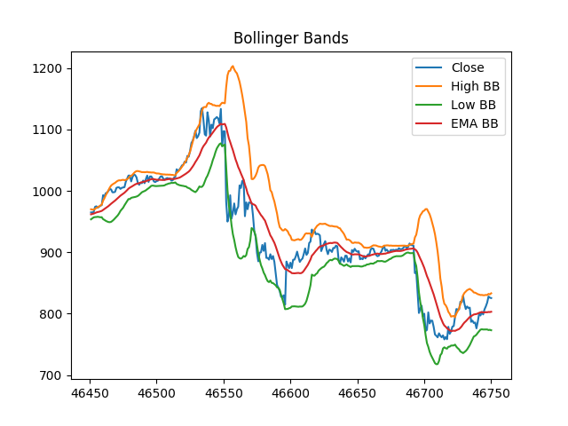

[](https://technical-analysis-library-in-python.readthedocs.io/en/latest/?badge=latest)
[](https://coveralls.io/github/bukosabino/ta)
[](https://github.com/psf/black)
[](http://prospector.landscape.io/en/master/)


[](https://www.paypal.me/guau/3)

# Technical Analysis Library in Python

It is a Technical Analysis library useful to do feature engineering from financial time series datasets (Open, Close, High, Low, Volume). It is built on Pandas and Numpy.



The library has implemented 43 indicators:

## Volume

ID | Name | Class | defs
-- |-- |-- |-- |
1 | Money Flow Index (MFI) | [MFIIndicator](https://technical-analysis-library-in-python.readthedocs.io/en/latest/ta.html#ta.volume.MFIIndicator) | [money_flow_index](https://technical-analysis-library-in-python.readthedocs.io/en/latest/ta.html#ta.volume.money_flow_index)
2 | Accumulation/Distribution Index (ADI) | [AccDistIndexIndicator](https://technical-analysis-library-in-python.readthedocs.io/en/latest/ta.html#ta.volume.AccDistIndexIndicator) | [acc_dist_index](https://technical-analysis-library-in-python.readthedocs.io/en/latest/ta.html#ta.volume.acc_dist_index)
3 | On-Balance Volume (OBV) | [OnBalanceVolumeIndicator](https://technical-analysis-library-in-python.readthedocs.io/en/latest/ta.html#ta.volume.OnBalanceVolumeIndicator) | [on_balance_volume](https://technical-analysis-library-in-python.readthedocs.io/en/latest/ta.html#ta.volume.on_balance_volume)
4 | Chaikin Money Flow (CMF) | [ChaikinMoneyFlowIndicator](https://technical-analysis-library-in-python.readthedocs.io/en/latest/ta.html#ta.volume.ChaikinMoneyFlowIndicator) | [chaikin_money_flow](https://technical-analysis-library-in-python.readthedocs.io/en/latest/ta.html#ta.volume.chaikin_money_flow)
5 | Force Index (FI) | [ForceIndexIndicator](https://technical-analysis-library-in-python.readthedocs.io/en/latest/ta.html#ta.volume.ForceIndexIndicator) | [force_index](https://technical-analysis-library-in-python.readthedocs.io/en/latest/ta.html#ta.volume.force_index)
6 | Ease of Movement (EoM, EMV) | [EaseOfMovementIndicator](https://technical-analysis-library-in-python.readthedocs.io/en/latest/ta.html#ta.volume.EaseOfMovementIndicator) | [ease_of_movement](https://technical-analysis-library-in-python.readthedocs.io/en/latest/ta.html#ta.volume.ease_of_movement)<br>[sma_ease_of_movement](https://technical-analysis-library-in-python.readthedocs.io/en/latest/ta.html#ta.volume.sma_ease_of_movement)
7 | Volume-price Trend (VPT) | [VolumePriceTrendIndicator](https://technical-analysis-library-in-python.readthedocs.io/en/latest/ta.html#ta.volume.VolumePriceTrendIndicator)| [volume_price_trend](https://technical-analysis-library-in-python.readthedocs.io/en/latest/ta.html#ta.volume.volume_price_trend)
8 | Negative Volume Index (NVI) | [NegativeVolumeIndexIndicator](https://technical-analysis-library-in-python.readthedocs.io/en/latest/ta.html#ta.volume.NegativeVolumeIndexIndicator)| [negative_volume_index](https://technical-analysis-library-in-python.readthedocs.io/en/latest/ta.html#ta.volume.negative_volume_index)
9 | Volume Weighted Average Price (VWAP) | [VolumeWeightedAveragePrice](https://technical-analysis-library-in-python.readthedocs.io/en/latest/ta.html#ta.volume.VolumeWeightedAveragePrice) | [volume_weighted_average_price](https://technical-analysis-library-in-python.readthedocs.io/en/latest/ta.html#ta.volume.volume_weighted_average_price)


<br>

## Volatility

ID | Name | Class | defs
-- |-- |-- |-- |
10 | Average True Range (ATR) | [AverageTrueRange](https://technical-analysis-library-in-python.readthedocs.io/en/latest/ta.html#ta.volatility.AverageTrueRange) | [average_true_range](https://technical-analysis-library-in-python.readthedocs.io/en/latest/ta.html#ta.volatility.average_true_range)
11 | Bollinger Bands (BB) | [BollingerBands](https://technical-analysis-library-in-python.readthedocs.io/en/latest/ta.html#ta.volatility.BollingerBands) | [bollinger_hband](https://technical-analysis-library-in-python.readthedocs.io/en/latest/ta.html#ta.volatility.bollinger_hband)<br>[bollinger_hband_indicator](https://technical-analysis-library-in-python.readthedocs.io/en/latest/ta.html#ta.volatility.bollinger_hband_indicator)<br>[bollinger_lband](https://technical-analysis-library-in-python.readthedocs.io/en/latest/ta.html#ta.volatility.bollinger_lband)<br>[bollinger_lband_indicator](https://technical-analysis-library-in-python.readthedocs.io/en/latest/ta.html#ta.volatility.bollinger_lband_indicator)<br>[bollinger_mavg](https://technical-analysis-library-in-python.readthedocs.io/en/latest/ta.html#ta.volatility.bollinger_mavg)<br>[bollinger_pband](https://technical-analysis-library-in-python.readthedocs.io/en/latest/ta.html#ta.volatility.bollinger_pband)<br>[bollinger_wband](https://technical-analysis-library-in-python.readthedocs.io/en/latest/ta.html#ta.volatility.bollinger_wband)
12 | Keltner Channel (KC) | [KeltnerChannel](https://technical-analysis-library-in-python.readthedocs.io/en/latest/ta.html#ta.volatility.KeltnerChannel) |  [keltner_channel_hband](https://technical-analysis-library-in-python.readthedocs.io/en/latest/ta.html#ta.volatility.keltner_channel_hband)<br>[keltner_channel_hband_indicator](https://technical-analysis-library-in-python.readthedocs.io/en/latest/ta.html#ta.volatility.keltner_channel_hband_indicator)<br>[keltner_channel_lband](https://technical-analysis-library-in-python.readthedocs.io/en/latest/ta.html#ta.volatility.keltner_channel_lband)<br>[keltner_channel_lband_indicator](https://technical-analysis-library-in-python.readthedocs.io/en/latest/ta.html#ta.volatility.keltner_channel_lband_indicator)<br>[keltner_channel_mband](https://technical-analysis-library-in-python.readthedocs.io/en/latest/ta.html#ta.volatility.keltner_channel_mband)<br>[keltner_channel_pband](https://technical-analysis-library-in-python.readthedocs.io/en/latest/ta.html#ta.volatility.keltner_channel_pband)<br>[keltner_channel_wband](https://technical-analysis-library-in-python.readthedocs.io/en/latest/ta.html#ta.volatility.keltner_channel_wband)
13 | Donchian Channel (DC) | [DonchianChannel](https://technical-analysis-library-in-python.readthedocs.io/en/latest/ta.html#ta.volatility.DonchianChannel)| [donchian_channel_hband](https://technical-analysis-library-in-python.readthedocs.io/en/latest/ta.html#ta.volatility.donchian_channel_hband)<br>[donchian_channel_lband](https://technical-analysis-library-in-python.readthedocs.io/en/latest/ta.html#ta.volatility.donchian_channel_lband)<br>[donchian_channel_mban](https://technical-analysis-library-in-python.readthedocs.io/en/latest/ta.html#ta.volatility.donchian_channel_mband)<br>[donchian_channel_pband](https://technical-analysis-library-in-python.readthedocs.io/en/latest/ta.html#ta.volatility.donchian_channel_pband)<br>[donchian_channel_wband](https://technical-analysis-library-in-python.readthedocs.io/en/latest/ta.html#ta.volatility.donchian_channel_wband)
14 | Ulcer Index (UI) | [UlcerIndex](https://technical-analysis-library-in-python.readthedocs.io/en/latest/ta.html#ta.volatility.UlcerIndex)|  [ulcer_index](https://technical-analysis-library-in-python.readthedocs.io/en/latest/ta.html#ta.volatility.ulcer_index)

<br>

## Trend

ID | Name | Class | defs
-- |-- |-- |-- |
15 | Simple Moving Average (SMA) | [SMAIndicator](https://technical-analysis-library-in-python.readthedocs.io/en/latest/ta.html#ta.trend.SMAIndicator) | [sma_indicator](https://technical-analysis-library-in-python.readthedocs.io/en/latest/ta.html#ta.trend.sma_indicator)
16 | Exponential Moving Average (EMA) | [EMAIndicator](https://technical-analysis-library-in-python.readthedocs.io/en/latest/ta.html#ta.trend.EMAIndicator)  | [ema_indicator](https://technical-analysis-library-in-python.readthedocs.io/en/latest/ta.html#ta.trend.ema_indicator) | Trend
17 | Weighted Moving Average (WMA) | [WMAIndicator](https://technical-analysis-library-in-python.readthedocs.io/en/latest/ta.html#ta.trend.WMAIndicator) | [wma_indicator](https://technical-analysis-library-in-python.readthedocs.io/en/latest/ta.html#ta.trend.wma_indicator)
18 | Moving Average Convergence Divergence (MACD) | [MACD](https://technical-analysis-library-in-python.readthedocs.io/en/latest/ta.html#ta.trend.MACD) | [macd](https://technical-analysis-library-in-python.readthedocs.io/en/latest/ta.html#ta.trend.macd) <br>[macd_diff](https://technical-analysis-library-in-python.readthedocs.io/en/latest/ta.html#ta.trend.macd_diff)<br>[macd_signal](https://technical-analysis-library-in-python.readthedocs.io/en/latest/ta.html#ta.trend.macd_signal)
19 | Average Directional Movement Index (ADX) | [ADXIndicator](https://technical-analysis-library-in-python.readthedocs.io/en/latest/ta.html#ta.trend.ADXIndicator) | [adx](https://technical-analysis-library-in-python.readthedocs.io/en/latest/ta.html#ta.trend.adx)<br>[adx_neg](https://technical-analysis-library-in-python.readthedocs.io/en/latest/ta.html#ta.trend.adx_neg)<br>[adx_pos](https://technical-analysis-library-in-python.readthedocs.io/en/latest/ta.html#ta.trend.adx_pos)
20 | Vortex Indicator (VI) | [VortexIndicator](https://technical-analysis-library-in-python.readthedocs.io/en/latest/ta.html#ta.trend.VortexIndicator) | [vortex_indicator_neg](https://technical-analysis-library-in-python.readthedocs.io/en/latest/ta.html#ta.trend.vortex_indicator_neg) <br>[vortex_indicator_pos](https://technical-analysis-library-in-python.readthedocs.io/en/latest/ta.html#ta.trend.vortex_indicator_pos)
21 | Trix (TRIX) | [TRIXIndicator](https://technical-analysis-library-in-python.readthedocs.io/en/latest/ta.html#ta.trend.TRIXIndicator) | [trix](https://technical-analysis-library-in-python.readthedocs.io/en/latest/ta.html#ta.trend.trix)
22 | Mass Index (MI) | [MassIndex](https://technical-analysis-library-in-python.readthedocs.io/en/latest/ta.html#ta.trend.MassIndex) | [mass_index](https://technical-analysis-library-in-python.readthedocs.io/en/latest/ta.html#ta.trend.mass_index)
23 | Commodity Channel Index (CCI) | [CCIIndicator](https://technical-analysis-library-in-python.readthedocs.io/en/latest/ta.html#ta.trend.CCIIndicator)| [cci](https://technical-analysis-library-in-python.readthedocs.io/en/latest/ta.html#ta.trend.cci)
24 | Detrended Price Oscillator (DPO) | [DPOIndicator](https://technical-analysis-library-in-python.readthedocs.io/en/latest/ta.html#ta.trend.DPOIndicator) | [dpo](https://technical-analysis-library-in-python.readthedocs.io/en/latest/ta.html#ta.trend.dpo)
25 | KST Oscillator (KST) | [KSTIndicator](https://technical-analysis-library-in-python.readthedocs.io/en/latest/ta.html#ta.trend.KSTIndicator)  | [kst](https://technical-analysis-library-in-python.readthedocs.io/en/latest/ta.html#ta.trend.kst)<br>[kst_sig](https://technical-analysis-library-in-python.readthedocs.io/en/latest/ta.html#ta.trend.kst_sig)
26 | Ichimoku Kinkō Hyō (Ichimoku) | [IchimokuIndicator](https://technical-analysis-library-in-python.readthedocs.io/en/latest/ta.html#ta.trend.IchimokuIndicator) | [ichimoku_a](https://technical-analysis-library-in-python.readthedocs.io/en/latest/ta.html#ta.trend.ichimoku_a)<br>[ichimoku_b](https://technical-analysis-library-in-python.readthedocs.io/en/latest/ta.html#ta.trend.ichimoku_b)<br>[ichimoku_base_line](https://technical-analysis-library-in-python.readthedocs.io/en/latest/ta.html#ta.trend.ichimoku_base_line)<br>[ichimoku_conversion_line](https://technical-analysis-library-in-python.readthedocs.io/en/latest/ta.html#ta.trend.ichimoku_conversion_line)
27 | Parabolic Stop And Reverse (Parabolic SAR) | [PSARIndicator](https://technical-analysis-library-in-python.readthedocs.io/en/latest/ta.html#ta.trend.PSARIndicator) | [psar_down](https://technical-analysis-library-in-python.readthedocs.io/en/latest/ta.html#ta.trend.psar_down) <br>[psar_down_indicator](https://technical-analysis-library-in-python.readthedocs.io/en/latest/ta.html#ta.trend.psar_down_indicator)<br>[psar_up](https://technical-analysis-library-in-python.readthedocs.io/en/latest/ta.html#ta.trend.psar_up)<br>[psar_up_indicator](https://technical-analysis-library-in-python.readthedocs.io/en/latest/ta.html#ta.trend.psar_up_indicator)
28 | Schaff Trend Cycle (STC) | [STCIndicator](https://technical-analysis-library-in-python.readthedocs.io/en/latest/ta.html#ta.trend.STCIndicator) | [stc](https://technical-analysis-library-in-python.readthedocs.io/en/latest/ta.html#ta.trend.stc)
29 | Aroon Indicator | [AroonIndicator](https://technical-analysis-library-in-python.readthedocs.io/en/latest/ta.html#ta.trend.AroonIndicator) | [aroon_down](https://technical-analysis-library-in-python.readthedocs.io/en/latest/ta.html#ta.trend.aroon_down)<br>[aroon_up](https://technical-analysis-library-in-python.readthedocs.io/en/latest/ta.html#ta.trend.aroon_up)


<br>

## Momentum

ID | Name | Class | defs
-- |-- |-- |-- |
30 | Relative Strength Index (RSI) | [RSIIndicator](https://technical-analysis-library-in-python.readthedocs.io/en/latest/ta.html#ta.momentum.RSIIndicator) | [rsi](https://technical-analysis-library-in-python.readthedocs.io/en/latest/ta.html#ta.momentum.rsi)
31 | Stochastic RSI (SRSI) | [StochRSIIndicator](https://technical-analysis-library-in-python.readthedocs.io/en/latest/ta.html#ta.momentum.StochRSIIndicator) | [stochrsi](https://technical-analysis-library-in-python.readthedocs.io/en/latest/ta.html#ta.momentum.stochrsi)<br>[stochrsi_d](https://technical-analysis-library-in-python.readthedocs.io/en/latest/ta.html#ta.momentum.stochrsi_d)<br>[stochrsi_k](https://technical-analysis-library-in-python.readthedocs.io/en/latest/ta.html#ta.momentum.stochrsi_k)
32 | True strength index (TSI) | [TSIIndicator](https://technical-analysis-library-in-python.readthedocs.io/en/latest/ta.html#ta.momentum.TSIIndicator) | [tsi](https://technical-analysis-library-in-python.readthedocs.io/en/latest/ta.html#ta.momentum.tsi)
33 | Ultimate Oscillator (UO) | [UltimateOscillator](https://technical-analysis-library-in-python.readthedocs.io/en/latest/ta.html#ta.momentum.UltimateOscillator) | [ultimate_oscillator](https://technical-analysis-library-in-python.readthedocs.io/en/latest/ta.html#ta.momentum.ultimate_oscillator)
34 | Stochastic Oscillator (SR) | [StochasticOscillator](https://technical-analysis-library-in-python.readthedocs.io/en/latest/ta.html#ta.momentum.StochasticOscillator) | [stoch](https://technical-analysis-library-in-python.readthedocs.io/en/latest/ta.html#ta.momentum.stoch)<br>[stoch_signal](https://technical-analysis-library-in-python.readthedocs.io/en/latest/ta.html#ta.momentum.stoch_signal)
35 | Williams %R (WR) | [WilliamsRIndicator](https://technical-analysis-library-in-python.readthedocs.io/en/latest/ta.html#ta.momentum.WilliamsRIndicator) | [williams_r](https://technical-analysis-library-in-python.readthedocs.io/en/latest/ta.html#ta.momentum.williams_r)
36 | Awesome Oscillator (AO) | [AwesomeOscillatorIndicator](https://technical-analysis-library-in-python.readthedocs.io/en/latest/ta.html#ta.momentum.AwesomeOscillatorIndicator) | [awesome_oscillator](https://technical-analysis-library-in-python.readthedocs.io/en/latest/ta.html#ta.momentum.awesome_oscillator)
37 | Kaufman's Adaptive Moving Average (KAMA) | [KAMAIndicator](https://technical-analysis-library-in-python.readthedocs.io/en/latest/ta.html#ta.momentum.KAMAIndicator) | [kama](https://technical-analysis-library-in-python.readthedocs.io/en/latest/ta.html#ta.momentum.kama)
38 | Rate of Change (ROC) | [ROCIndicator](https://technical-analysis-library-in-python.readthedocs.io/en/latest/ta.html#ta.momentum.ROCIndicator) | [roc](https://technical-analysis-library-in-python.readthedocs.io/en/latest/ta.html#ta.momentum.roc)
39 | Percentage Price Oscillator (PPO) | [PercentagePriceOscillator](https://technical-analysis-library-in-python.readthedocs.io/en/latest/ta.html#ta.momentum.PercentagePriceOscillator) | [ppo](https://technical-analysis-library-in-python.readthedocs.io/en/latest/ta.html#ta.momentum.ppo)<br>[ppo_hist](https://technical-analysis-library-in-python.readthedocs.io/en/latest/ta.html#ta.momentum.ppo_hist)<br>[ppo_signal](https://technical-analysis-library-in-python.readthedocs.io/en/latest/ta.html#ta.momentum.ppo_signal)
40 | Percentage Volume Oscillator (PVO) | [PercentageVolumeOscillator](https://technical-analysis-library-in-python.readthedocs.io/en/latest/ta.html#ta.momentum.PercentageVolumeOscillator) | [pvo](https://technical-analysis-library-in-python.readthedocs.io/en/latest/ta.html#ta.momentum.pvo)<br>[pvo_hist](https://technical-analysis-library-in-python.readthedocs.io/en/latest/ta.html#ta.momentum.pvo_hist)<br>[pvo_signal](https://technical-analysis-library-in-python.readthedocs.io/en/latest/ta.html#ta.momentum.pvo_signal)


<br>

## Others

ID | Name | Class | defs
-- |-- |-- |-- |
41 | Daily Return (DR) | [DailyReturnIndicator](https://technical-analysis-library-in-python.readthedocs.io/en/latest/ta.html#ta.others.DailyReturnIndicator) | [daily_return](https://technical-analysis-library-in-python.readthedocs.io/en/latest/ta.html#ta.others.daily_return)
42 | Daily Log Return (DLR) | [DailyLogReturnIndicator](https://technical-analysis-library-in-python.readthedocs.io/en/latest/ta.html#ta.others.DailyLogReturnIndicator) | [daily_log_return](https://technical-analysis-library-in-python.readthedocs.io/en/latest/ta.html#ta.others.daily_log_return)
43 | Cumulative Return (CR) | [CumulativeReturnIndicator](https://technical-analysis-library-in-python.readthedocs.io/en/latest/ta.html#ta.others.CumulativeReturnIndicator) | [cumulative_return](https://technical-analysis-library-in-python.readthedocs.io/en/latest/ta.html#ta.others.cumulative_return)

<br>


# Documentation

https://technical-analysis-library-in-python.readthedocs.io/en/latest/


# Motivation to use

* [English](https://towardsdatascience.com/technical-analysis-library-to-financial-datasets-with-pandas-python-4b2b390d3543)
* [Spanish](https://medium.com/datos-y-ciencia/biblioteca-de-an%C3%A1lisis-t%C3%A9cnico-sobre-series-temporales-financieras-para-machine-learning-con-cb28f9427d0)


# How to use (Python 3)

```sh
$ pip install --upgrade ta
```

To use this library you should have a financial time series dataset including `Timestamp`, `Open`, `High`, `Low`, `Close` and `Volume` columns.

You should clean or fill NaN values in your dataset before add technical analysis features.

You can get code examples in [examples_to_use](https://github.com/bukosabino/ta/tree/master/examples_to_use) folder.

You can visualize the features in [this notebook](https://github.com/bukosabino/ta/blob/master/examples_to_use/visualize_features.ipynb).


#### Example adding all features

```python
import pandas as pd
from ta import add_all_ta_features
from ta.utils import dropna


# Load datas
df = pd.read_csv('ta/tests/data/datas.csv', sep=',')

# Clean NaN values
df = dropna(df)

# Add all ta features
df = add_all_ta_features(
    df, open="Open", high="High", low="Low", close="Close", volume="Volume_BTC")
```


#### Example adding particular feature

```python
import pandas as pd
from ta.utils import dropna
from ta.volatility import BollingerBands


# Load datas
df = pd.read_csv('ta/tests/data/datas.csv', sep=',')

# Clean NaN values
df = dropna(df)

# Initialize Bollinger Bands Indicator
indicator_bb = BollingerBands(close=df["Close"], window=20, window_dev=2)

# Add Bollinger Bands features
df['bb_bbm'] = indicator_bb.bollinger_mavg()
df['bb_bbh'] = indicator_bb.bollinger_hband()
df['bb_bbl'] = indicator_bb.bollinger_lband()

# Add Bollinger Band high indicator
df['bb_bbhi'] = indicator_bb.bollinger_hband_indicator()

# Add Bollinger Band low indicator
df['bb_bbli'] = indicator_bb.bollinger_lband_indicator()

# Add Width Size Bollinger Bands
df['bb_bbw'] = indicator_bb.bollinger_wband()

# Add Percentage Bollinger Bands
df['bb_bbp'] = indicator_bb.bollinger_pband()
```


# Deploy and develop (for developers)

```sh
$ git clone https://github.com/bukosabino/ta.git
$ cd ta
$ pip install -r requirements-play.txt
$ make test
```


# Sponsor


Thank you to [OpenSistemas](https://opensistemas.com)! It is because of your contribution that I am able to continue the development of this open source library.


# Based on

* https://en.wikipedia.org/wiki/Technical_analysis
* https://pandas.pydata.org
* https://github.com/FreddieWitherden/ta
* https://github.com/femtotrader/pandas_talib


# In Progress

* Automated tests for all the indicators.


# TODO

* Use [NumExpr](https://github.com/pydata/numexpr) to speed up the NumPy/Pandas operations? [Article Motivation](https://towardsdatascience.com/speed-up-your-numpy-and-pandas-with-numexpr-package-25bd1ab0836b)
* Add [more technical analysis features](https://en.wikipedia.org/wiki/Technical_analysis).
* Wrapper to get financial data.
* Use of the Pandas multi-indexing techniques to calculate several indicators at the same time.
* Use Plotly/Streamlit to visualize features


# Changelog

Check the [changelog](https://github.com/bukosabino/ta/blob/master/RELEASE.md) of project.


# Donation

If you think `ta` library help you, please consider [buying me a coffee](https://www.paypal.me/guau/3).


# Credits

Developed by Darío López Padial (aka Bukosabino) and [other contributors](https://github.com/bukosabino/ta/graphs/contributors).

Please, let me know about any comment or feedback.

Also, I am a software engineer freelance focused on Data Science using Python tools such as Pandas, Scikit-Learn, Backtrader, Zipline or Catalyst. Don't hesitate to contact me if you need to develop something related with this library, Python, Technical Analysis, AlgoTrading, Machine Learning, etc.
